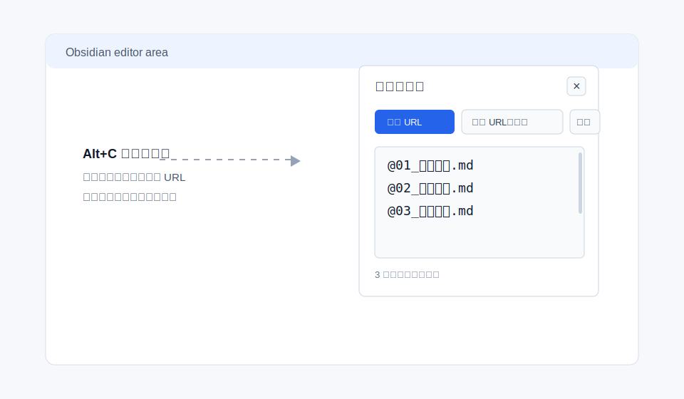
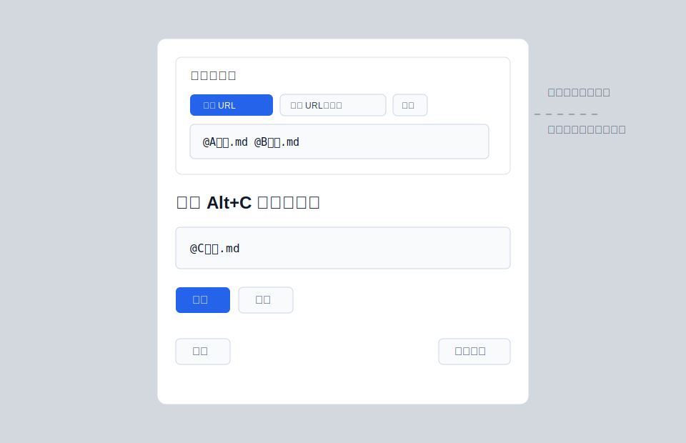
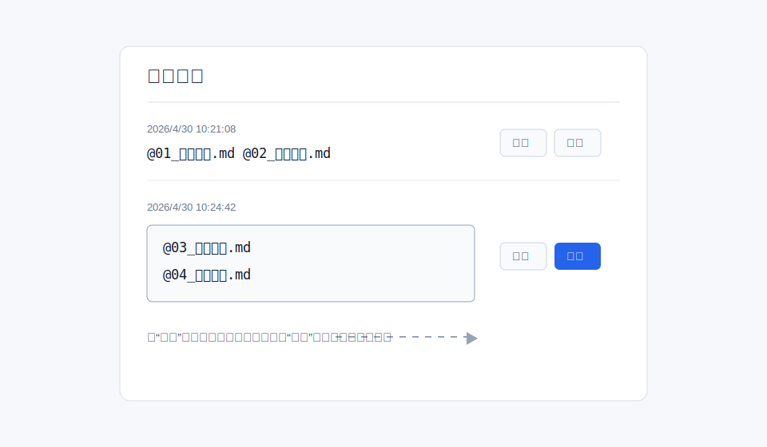

# Copy Selected Name

## 演示视频 / Demo Video

<video src="assets/demo.mp4" controls width="100%" title="Copy Selected Name Obsidian plugin demo"></video>

[如果视频没有直接显示，点击这里观看演示视频。 / Click here to watch the demo video if it does not render inline.](assets/demo.mp4)

Copy Selected Name 是一个 Obsidian 桌面端插件，用于在文件列表中选中文件或文件夹后，通过 `Alt+C` 快速生成适合 AI 对话和笔记上下文引用的文件名格式，例如：

```text
@01_抖音拆解.md 
```

它特别适合这些场景：

- 在 Obsidian 里使用 Claudian、Claude、Codex 或其他 AI 对话插件时，快速把当前文件作为上下文引用插入输入框。
- 同时选择多个笔记文件，把它们整理成一串可直接粘贴给 AI 的文件名引用。
- 在做短视频拆解、选题策划、项目复盘、客户资料整理时，快速收集多个相关文件名。
- 需要在普通 `@文件名.md` 格式和 `obsidian://open?...` Obsidian URL 格式之间来回转换。

插件使用自己的内部剪贴板，不会默认覆盖系统剪贴板。只有点击“转成 ObsidianURL并复制”时，才会把内容写入系统剪贴板。

## 联系方式

微信：`abc7752abc`

备注：问题反馈、建议、合作

## 界面预览

### 剪贴板内容面板



### 覆盖 / 追加弹窗



### 历史记录编辑



## 安装方法

### 方法一：下载 ZIP 手动安装

1. 打开本仓库页面。
2. 点击 `Code -> Download ZIP`。
3. 解压 ZIP 文件。
4. 将解压后的插件文件夹重命名为：

```text
copy-selected-name
```

5. 把这个文件夹放到你的 Obsidian 库插件目录：

```text
<你的 Obsidian 库>/.obsidian/plugins/copy-selected-name
```

以 Windows 为例：

```text
D:\Obsidian\.obsidian\plugins\copy-selected-name
```

6. 确认文件夹里至少包含这些文件：

```text
main.js
manifest.json
styles.css
```

7. 打开 Obsidian，进入 `设置 -> 第三方插件 / Community plugins`。
8. 如果第三方插件还没有开启，先关闭安全模式。
9. 找到并启用 `Copy Selected Name`。

### 方法二：使用 Git 安装

进入你的 Obsidian 插件目录：

```bash
cd "<你的 Obsidian 库>/.obsidian/plugins"
```

克隆仓库，并把本地文件夹命名为插件 ID：

```bash
git clone https://github.com/mikeddy/obsidian-copy-selected-name.git copy-selected-name
```

然后回到 Obsidian，启用 `Copy Selected Name`。

## 使用方法

### 单个文件

1. 在 Obsidian 左侧文件列表里选中文件，例如 `01_抖音拆解.md`。
2. 按 `Alt+C`。
3. 插件内部剪贴板会得到：

```text
@01_抖音拆解.md 
```

格式规则：

- 前面自动加 `@`
- 保留 `.md`
- 末尾保留一个空格

### 多个文件

选中多个文件后按 `Alt+C`，会一次性复制所有选中文件名：

```text
@A文件.md @B文件.md @C文件.md 
```

### 单按、双按、三连按

- 单按 `Alt+C`：覆盖插件内部剪贴板。
- 1 秒内双按 `Alt+C`：进入追加逻辑，把新文件名追加到原内容后面。
- 1 秒内三连按 `Alt+C`：打开“覆盖 / 追加 / 取消”弹窗。

例如：

1. 在 A 文件上双按 `Alt+C`。
2. 切换到 B 文件。
3. 在 B 文件上双按 `Alt+C`。
4. 最终插件剪贴板会是：

```text
@A文件.md @B文件.md 
```

### Claudian 输入框联动

如果 Claudian 插件界面已经打开，并且光标正处在 Claudian 输入框中：

- 按 `Alt+C` 会把文件名引用直接插入光标所在位置。
- 同时更新插件内部剪贴板和右上角剪贴板面板。

如果光标不在 Claudian 输入框中：

- 插件只更新自己的内部剪贴板。

### 右上角剪贴板面板

每次按 `Alt+C`，右上角都会弹出剪贴板面板。

它支持：

- 查看当前插件剪贴板内容
- 直接编辑剪贴板内容
- 清空剪贴板
- 转成 Obsidian URL
- 再次点击后转回普通 `@文件名.md` 格式
- 生成 Obsidian URL 并复制到系统剪贴板

面板默认 3 秒后自动消失。鼠标悬停或正在编辑时不会消失，移开后重新开始 3 秒倒计时。

### 粘贴后自动清空

在 Obsidian 普通文本编辑区域按 `Ctrl+V`：

- 如果插件内部剪贴板有内容，会粘贴插件剪贴板内容。
- 第一次粘贴完成后，插件剪贴板会自动清空。

在插件自己的剪贴板面板中按 `Ctrl+V`：

- 不会触发自动清空。
- 你可以正常把外部文本粘进面板里编辑。

### 历史记录

打开“覆盖 / 追加 / 取消”弹窗后，可以进入历史记录。

历史记录支持：

- 查看之前复制过的内容
- 把某条历史重新放回插件剪贴板
- 编辑历史记录
- 保存修改后的历史记录

## English

Copy Selected Name is an Obsidian desktop plugin for quickly turning selected files or folders into AI-friendly mention text with `Alt+C`, such as:

```text
@01_Example.md 
```

It is designed for Obsidian-based AI workflows where you often need to reference notes, collect multiple files as context, insert file mentions into Claudian, or convert selected notes into Obsidian URLs.

## Contact

WeChat: `abc7752abc`

For feedback, suggestions, and collaboration.

## Installation

### Option 1: Download ZIP

1. Open this repository.
2. Click `Code -> Download ZIP`.
3. Unzip the downloaded file.
4. Rename the extracted folder to:

```text
copy-selected-name
```

5. Move it to your vault plugin folder:

```text
<your vault>/.obsidian/plugins/copy-selected-name
```

6. Make sure the folder contains at least:

```text
main.js
manifest.json
styles.css
```

7. Open Obsidian and go to `Settings -> Community plugins`.
8. Enable community plugins if needed.
9. Enable `Copy Selected Name`.

### Option 2: Install with Git

```bash
cd "<your vault>/.obsidian/plugins"
git clone https://github.com/mikeddy/obsidian-copy-selected-name.git copy-selected-name
```

Then enable `Copy Selected Name` in Obsidian.

## Features

- Single `Alt+C`: overwrite the plugin clipboard with selected file or folder mentions.
- Double `Alt+C` within 1 second: append new mentions to the current plugin clipboard.
- Triple `Alt+C` within 1 second: open the overwrite / append / cancel modal.
- Multi-selection support: copy several selected files or folders at once.
- Claudian support: insert mentions directly into the focused Claudian input textarea.
- Editable plugin clipboard panel: view, edit, clear, and reuse clipboard text.
- Obsidian URL conversion: toggle mention text into Obsidian URLs and back.
- Copy Obsidian URLs to the system clipboard without changing the plugin clipboard editor.
- Paste-once behavior: pasting outside the plugin clipboard panel clears the plugin clipboard after insertion.
- Editable history: copy, edit, and save previous copy records.

The plugin clipboard is separate from the system clipboard. The system clipboard is only written by the `转成 ObsidianURL并复制` button.

## Development

This plugin is plain CommonJS JavaScript and does not require a build step.

```bash
npm run check
```

`npm run check` runs:

```bash
node --check main.js
```
